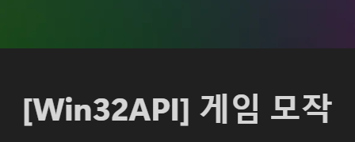
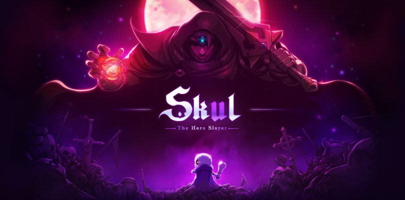

# Win32API Project

### 프로젝트 명
Skul : The Slayer Hero 모작

### 프로젝트 인원
1명 (김기훈)

### 목적
① Win32API 의 활용법을 학습 
② 게임 엔진의 구조와 흐름에 대한 이해 
③ 게임 모작을 통한 C/C++ 언어의 활용 능력의 향상 
④ 기능 구현 및 응용 능력 향상 

### 진행 계획
1주차 : Player 의 상태머신(FSM) 구현
 
2주차 : 일반 몬스터의 상태머신 구현
 
3주차 : 보스 몬스터의 상태머신 구현
 
4주차 : 이미지, 사운드와 같은 각종 이펙트 추가 및 마무리

### Notion URL

 

### Youtube URL

 

### 타임라인
23/06/23 ~ 07/31 : 
-&nbsp;Win32API 를 활용하여 게임엔진 제작 및 기본 기능 추가 

<b>23/08/01 :</b> 
[프로젝트 시작] 
-&nbsp;Player FSM 구현 
-&nbsp;Player Dash, Jump 구현 

<b>23/08/02 :</b> 
-&nbsp;Player 이동 공격 구현 
-&nbsp;몬스터 Patrol 기능 구현 

<b>23/08/03 :</b> 
-&nbsp;Player Attack 충돌체 생성 
-&nbsp;몬스터 Hit 판정 임시 구현 

<b>23/08/04 :</b> 
-&nbsp;Player Attack 의 Hit 판정 구현 
-&nbsp;Combo Attack 구현 및 Hit 판정 구현 

<b>23/08/05 :</b> 
-&nbsp;몬스터 Trace 기능 구현 
-&nbsp;몬스터 Attack 기능 구현중 

<b>23/08/06 :</b> 
-&nbsp;몬스터 Trace 기능 수정중 

<b>23/08/07 :</b> 
-&nbsp;몬스터 Trace 기능 수정완료 
-&nbsp;Stage Scene 에 배경 이미지 추가 
-&nbsp;Monster Attack 구현 중 문제 발생 -> 수정중 

<b>23/08/08 :</b> 
-&nbsp;Monster Attack 기능 수정완료 
-&nbsp;Player 의 Fall 상태에서 Fall_Repeat 애니메이션 추가 

<b>23/08/09 :</b> 
-&nbsp;Scene 생성 (Stage1, Stage2, Test, Title, Home, Loading) 
-&nbsp;Fall 상태중 Jump, DoubleJump 가능하도록 기능 추가 
-&nbsp;Stage1_Monster_Scene에 Floor 객체 추가 

<b>23/08/10 :</b> 
-&nbsp;Door 클래스 생성 
-&nbsp;Stage1_Enter_Scene에 Door 객체 추가 

<b>23/08/11 :</b> 
-&nbsp;Home, Stage1_Boss_Enter 배경추가 
-&nbsp;Camera 제한값 설정(offset 추가) 
-&nbsp;Stage1_Boss_Enter 충돌체 추가 

<b>23/08/13 :</b> 
-&nbsp;HomeScene NPC 추가 
-&nbsp;Player Jump시 윗 Floor 객체 통과 가능하도록 Floor 충돌처리 코드 수정 
-&nbsp;Wall, Trap 클래스 생성 

<b>23/08/14 :</b> 
-&nbsp;NPC Cat_Seol 추가 

<b>23/08/15 :</b> 
-&nbsp;Monster_1, Monster_2, Middle_Boss,Boss_Enter Map 이미지 수정 

<b>23/08/16 :</b> 
-&nbsp;Player Jump 상태중 Ground 상태되면 Jump 상태 유지되던 버그 수정 완료 
-&nbsp;Monster2 Scene 에 Wall, Fall 객체 추가완료 
-&nbsp;Middle Boss Scene 에 Wall, Floor 객체 추가완료 
-&nbsp;Boss Enter Scene 에 Wall, Floor 객체 추가완료 
-&nbsp;Camera offset 값 수정시 부드럽게 화면 전환되도록 기능 추가완료 

<b>23/08/17 :</b> 
-&nbsp;Monster 동전 Drop, Boss Enter Map 수정 및 Door 객체 추가 
-&nbsp;Ent, ManAtArms 몬스터 추가, Monster 클래스 리펙토링 
-&nbsp;Monster Dead 시 피격판정 안 받도록 수정완료 
-&nbsp;Boss Enter Scene 카메라 임시 고정(수정필요) 
-&nbsp;Monster1 Scene 배경 이미지 수정완료 
-&nbsp;Player 머리 발사 스킬 추가완료 

<b>23/08/18 :</b> 
-&nbsp;Wall 객체 코드 수정, Scene 클래스 리펙토링 
-&nbsp;Boss Enter Door 추가, 각 Scene에 Monster Wave 구조 추가완료 

<b>23/08/19 :</b> 
-&nbsp;Monster FSM 수정 
-&nbsp;Monster 벽 충돌 버그 수정완료 
-&nbsp;GianticEnt 클래스 만드는 중 
-&nbsp;Boss 몬스터 클래스 생성 
-&nbsp;Collider 카메라 영향에 따른 위치설정코드 수정완료 

<b>23/08/20 :</b> 
-&nbsp;Wall 2차 버그 수정 
-&nbsp;GianticEnt 생성 완료 

<b>23/08/21 :</b> 
-&nbsp;Yggdrasill Boss 몬스터 추가 

<b>23/08/22 :</b> 
-&nbsp;Yggdrasill 이미지 png로 교체 
-&nbsp;Mage 몬스터 공격스킬 2개 추가 (오류발생 : Test Scene에서 이상한 벽과의 충돌이 발생함, Mage RageFire 공격모션중에 알수없는 방향 전환이 나옴 ) 

<b>23/08/23 :</b> 
-&nbsp;Mage 몬스터 FireBall 스킬 추가 

<b>23/08/04 :</b> 
-&nbsp;Mage 몬스터 FireBall, RagneFire 스킬 구현 완료 
-&nbsp;Mage 몬스터 Landing 스킬 구현 실패 
-&nbsp;Mage 몬스터 PhoenixLanding 스킬 구현 (Effect는 아직 안 넣음) 
-&nbsp;Yggdrasill Boss 몬스터 패턴 만드는 중, 첫번째 패턴 오류 발생 

<b>23/08/25 :</b> 
-&nbsp;Yggdrasill Boss 몬스터 공격스킬 수정 완료 
-&nbsp; Mage 몬스터 Phoenix Landing Attack 후 발생하던 공격 Animation 오류 해결완료 

<b>23/08/26 :</b> 
-&nbsp;Yggdrasill Boss 몬스터 Swipe 공격 추가 
-&nbsp;Yggdrasill Boss 몬스터 MagicOrb 공격패넡 추가 
-&nbsp;Player UI HpBar 추가 
-&nbsp;배경 이미지 bmp -> png 변경 

<b>23/08/27 :</b> 
-&nbsp;Player 이미지 bmp -> png 로 변경 
-&nbsp;Player NoHead 애니메이션 추가 
-&nbsp;Player Sound 작업 완료 
-&nbsp;Mage 몬스터 강제 커맨드 코드 추가 Q,W,E,R 

<b>23/08/28 :</b> 
-&nbsp;Yggdrasill Boss 몬스터 EnergyBomb 투사체 구현 완료 
-&nbsp;Yggdrasill Boss 몬스터 Energy Bomb Charge 이펙트 추가 
-&nbsp;Mage 몬스터 FireBall 투사체 로직 RigidBody 안쓰게 수정 
-&nbsp;Mage 몬스터 PhoenixLanding Ready Effect 추가 
-&nbsp;Mage 몬스터 HpBar넣는 중 
-&nbsp;Home Scene에 Seol 추가 
-&nbsp;Player Hit 애니메이션 추가 

<b>23/08/29 :</b> 
-&nbsp;Mage 몬스터 HpBar 추가 
-&nbsp;Yddrasill Boss 몬스터 HpBar 추가 

<b>23/08/30 :</b> 
-&nbsp;Boss HpBar 오류 해결 
-&nbsp;Yggdrasill Boss 몬스터 Hand 공격에 데미지 받게 설정 
-&nbsp;Mage 몬스터 Daed 모션 추가 
-&nbsp;Boss Scene 배경 추가 
-&nbsp;Mage 몬스터 FinishMove 만드는 중 
-&nbsp;Mage 몬스터 WorldOnFire Orb 애니메이션, 객체, 이펙트 추가 

<b>23/08/31 :</b> 
-&nbsp;Yggdrasill Boss 몬스터 강제 커맨드 추가 
-&nbsp;Yggdrasill Boss 몬스터 스킬, 데미지 추가, 2Phase 이미지 소스 추가 
-&nbsp;Yggdrasill Boss 몬스터 2Phase 진입시 공격횟수 2배 증가 적용 

<b>23/09/01 :</b> 
[프로젝트 마무리 및 발표] 

